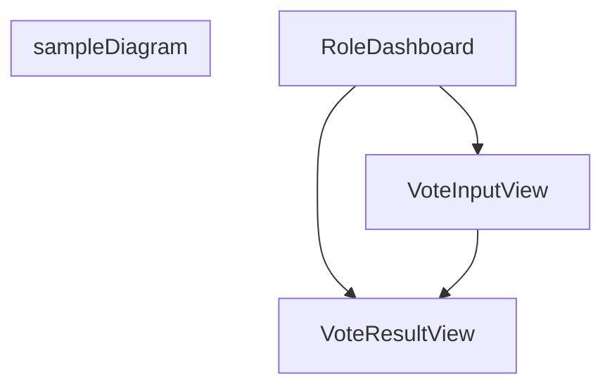

# 基本設計書フォーマット
[[Base Design Format]]
# 機能一覧
| 機能ID | 画面ID | 大カテゴリ | 中カテゴリ | 機能名 | 機能概要 | ユースケース |
| ---- | ---- | ----- | ----- | --- | ---- | ------ |
|      |      |       |       |     |      |        |
## 概要
- 「ログインできる」「タスクを追加できる」「グラフを表示できる」といった機能のリスト。
- **「〜できる」という表現で書く**
	- NG: 「ログイン画面」
	- OK: 「IDとパスワードを用いてシステムに**ログインできる**」
- **ワイヤーフレームと機能IDを紐づける**
- **「正常系」だけでなく「異常系」も意識する**
	- (例)重複した名前のプレイヤーは登録できないなど
# 画面設計
画面一覧やワイヤーフレームを定義
## 画面一覧
| 画面ID | 画面名 | URLパス | 概要  |
| ---- | --- | ----- | --- |
|      |     |       |     
## 画面遷移図

#### 成果物
- 画面遷移図
- ワイヤフレーム
	- 機能一覧の機能IDと紐づけ
- 画面一覧
# データ設計
**データ構造を定義**
- ER図
# ロジック設計
- クラス図
# 基本設計ナレッジ
## アーカイブ
[[C:\work\repos\Jinro_visualize\docs\spec\phase1_基本設計.md]]
## 基本設計書作成手順
## 機能一覧の作成
1. 機能一覧の作成
	1. 機能を詳細に定義
## 画面設計
1. plantumlのsaltでワイヤーフレームを作成
2. 作成したワイヤーフレームをプロンプトにしてGeminiでUIファイル(html/css, razor)を作成
3. 画面遷移図をシーケンス図で作成
	1. 各画面遷移とデータの受け渡しを定義
## データ設計
1. クラス図を作成
2. データの保存方法を定義