---

---
# 機能一覧

| 機能ID | 大カテゴリ | 中カテゴリ  | 機能                       |
| ---- | ----- | ------ | ------------------------ |
|      | 役職    | CO     | COした役職者をRoleDashboardに表示 |
|      | 役職    | 能力     | 占い師の占い結果を表示              |
|      | 役職    | 能力     | 霊媒師の霊媒結果を表示              |
|      | 役職    | 能力     | 騎士の護衛結果を表示               |
|      | 投票    | 投票入力   | 投票結果をドラッグアンドドロップで操作できる   |
|      | 投票    | タイムライン | 日別の投票履歴の表示               |
|      | 投票    | プレイヤー  | プレイヤー別の投票履歴の表示           |
|      | 投票    | 分析レポート | 投票分析結果の表示                |

# 画面設計
# 全体フロー図

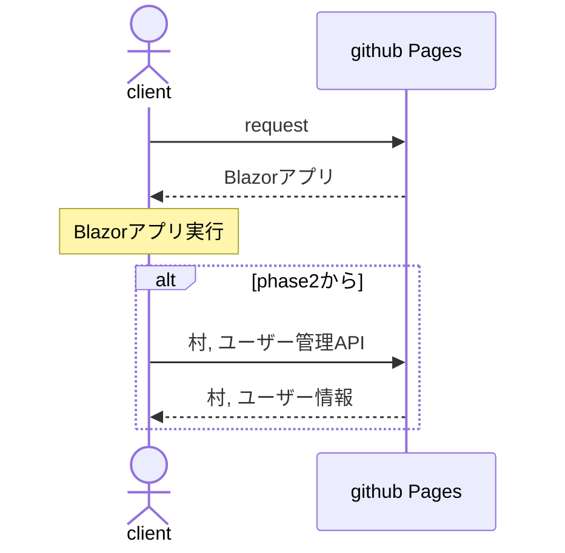
# Class Diagram
## Role class diagram
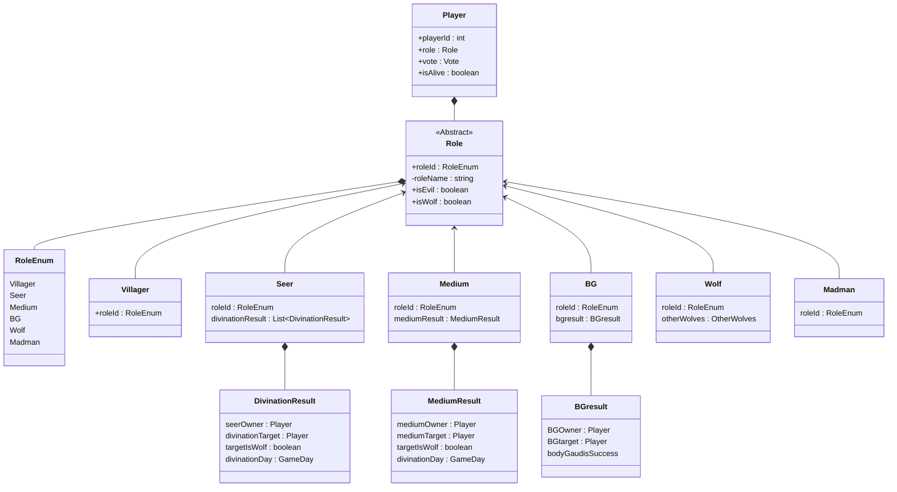

## Vote class diagram
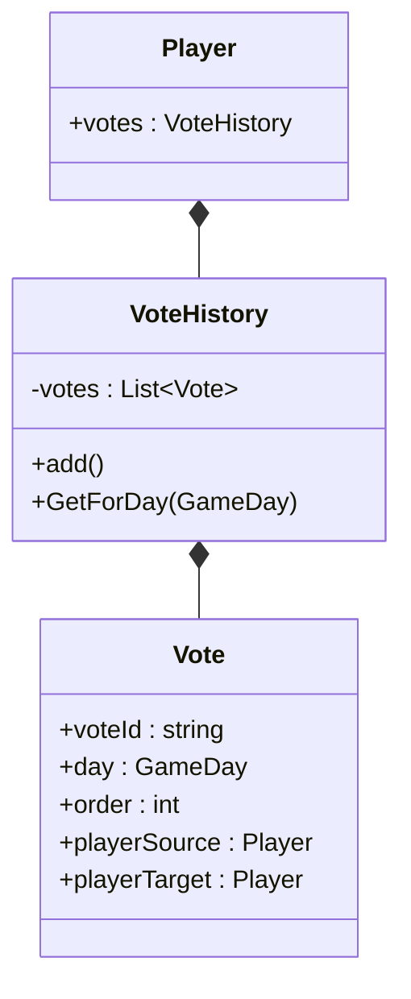
# GameDay class diagram
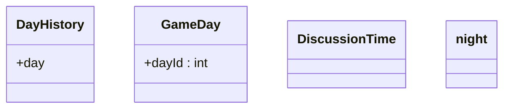
# メイン画面
## メイン画面コンポーネント class diagram
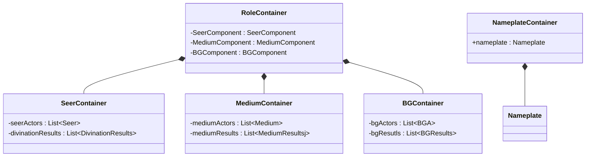

## メイン画面ワイヤーフレーム
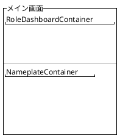
### 【メイン画面】RoleDashboardContainerワイヤーフレーム
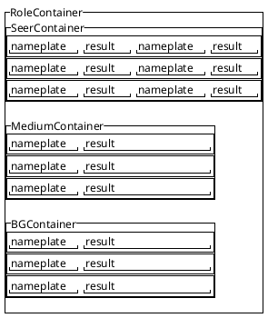
### 【メイン画面】NameplateContainer
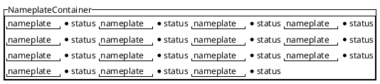
# 投票入力画面
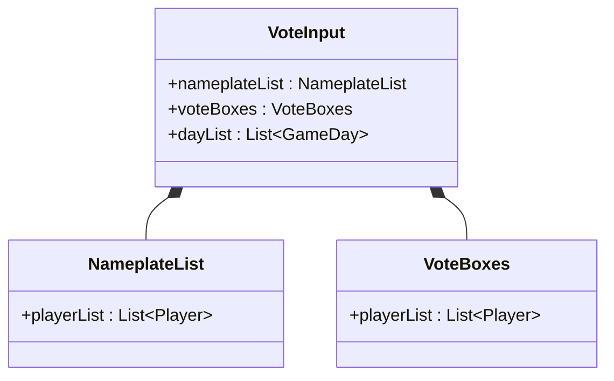
## 投票入力画面ワイヤーフレーム
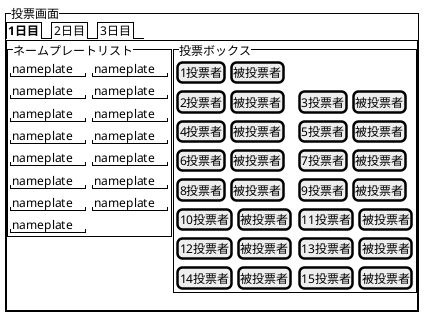
# 投票結果画面
##  投票結果画面ワイヤーフレーム
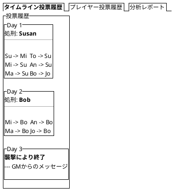
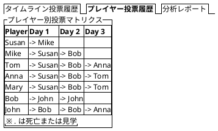
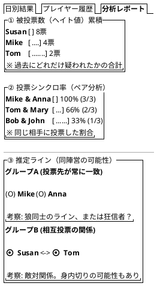
