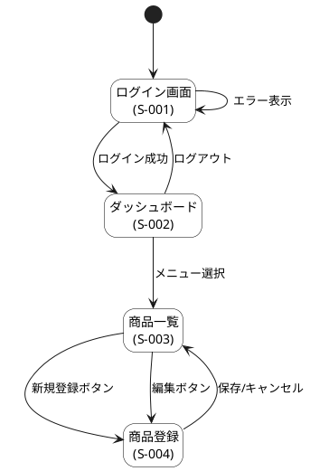
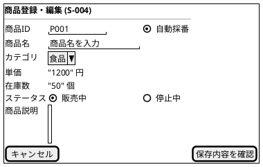
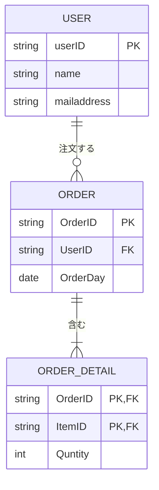
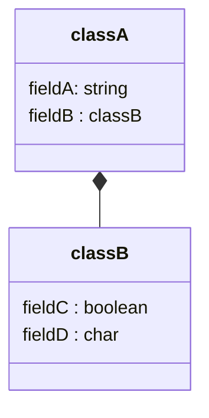

# Function List

| 機能ID | 画面ID | 大カテゴリ | 中カテゴリ | 機能名 | 機能概要 | ユースケース |
| ---- | ---- | ----- | ----- | --- | ---- | ------ |
|      |      |       |       |     |      |        |
# Screen Design
## Screen List

| 画面ID | 画面名 | URLパス | 概要  |
| ---- | --- | ----- | --- |
|      |     |       |     |
## Screen Sequence Diagram

## Wire Frame

# Data Design
## ER Diagram

## Entity Diagram
|**No**|**論理テーブル名**|**物理テーブル名**|**種類**|**概要・用途**|**発生頻度・想定件数**|
|---|---|---|---|---|---|
|1|会員マスタ|M_USER|マスタ|会員情報を管理する|低・10万件|
|2|商品マスタ|M_PRODUCT|マスタ|商品情報を管理する|低・1,000件|
|3|注文データ|T_ORDER|トランザクション|注文ヘッダ情報|高・月1万件増加|
|4|注文明細|T_ORDER_DETAIL|トランザクション|注文ごとの商品内訳|高・月3万件増加|
# Logic Design
## Class Diagram

