```plantuml
@startsalt
{ Sample
	{^ AAA
		BBB
	}
}
@endsalt
```

# 環境構築
## vscode
- **拡張機能で「PlantUML」をインストール**
- **microsoft open jdkをインストール(java未インストールなら)**
# plantuml
```
@startuml
' コメントは文頭にシングルクォーテーション
@endml
```
# salt
**GUIの記述**
`@startsalt`
`@endsalt`
**コンポーネントを垂直に配置**
- `{ }`
**コンポーネントを水平に配置**
**注意** 水平に並べるコンポーネントを１行に記述して、コンポーネント間に | を記述する
{+
	{AAA} | {BBB}
}
コンポーネントの上にXXXを表示
**注意**コンポーネントの中身も記述しないと、うまく描画されない
- `^ XXX`
```
@startsalt
{
  "テキスト表示（引用符なしでも可）"
  "テキスト入力欄（引用符あり）"
  [ボタン]
  ( ) 未選択ラジオ
  (X) 選択済ラジオ
  [ ] 未選択チェック
  [X] 選択済チェック
  ^ドロップダウン（プルダウン）^
  --
  "水平線（セパレーター）はハイフン2本"
  <b>太字</b>
  / タブ1 | タブ2 | タブ3
}
@endsalt
```

