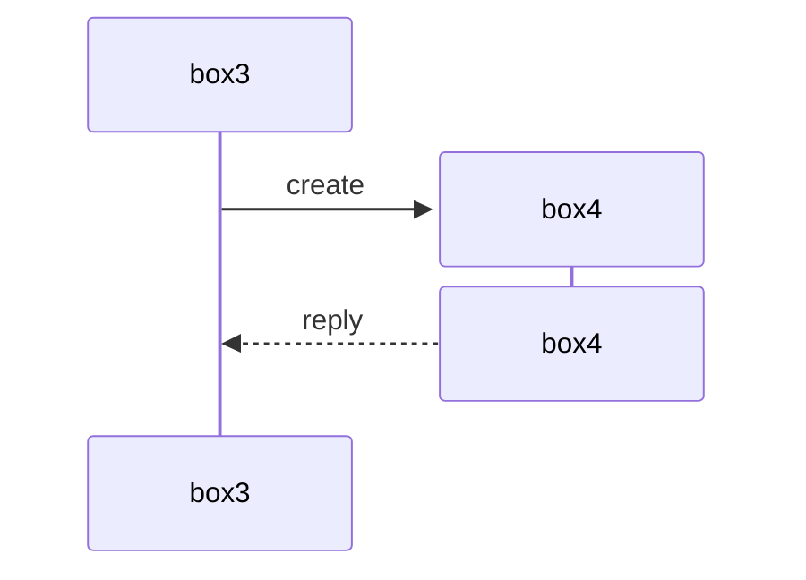
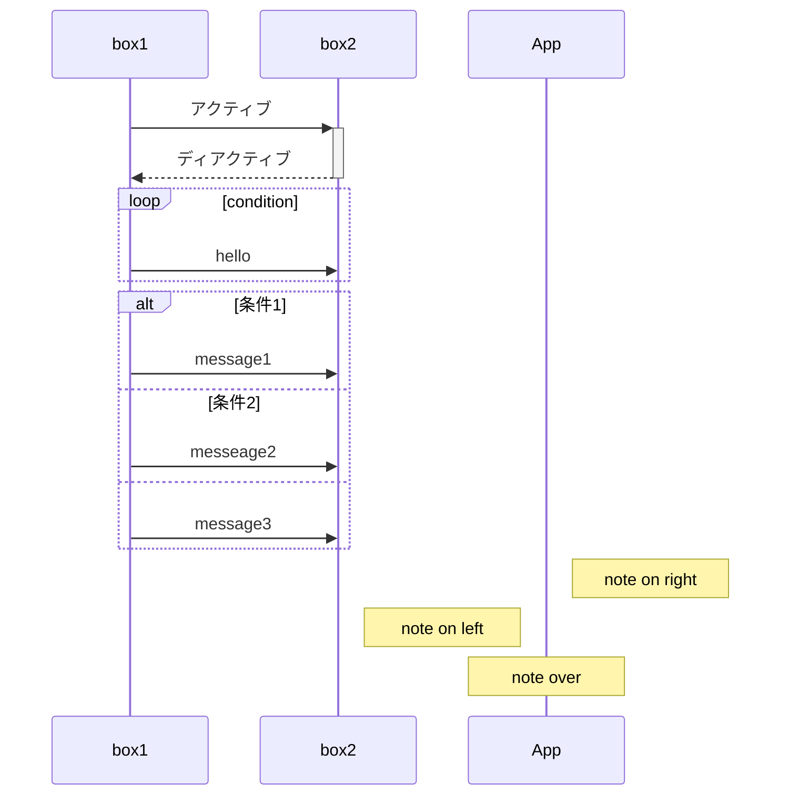
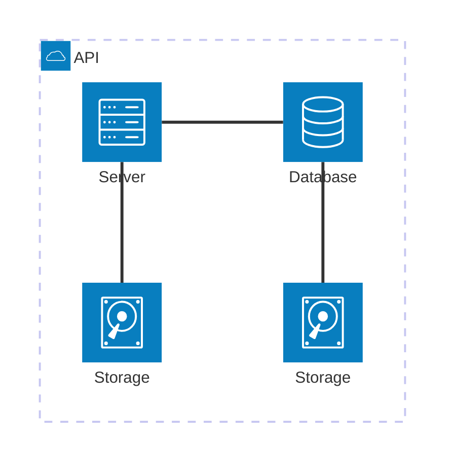
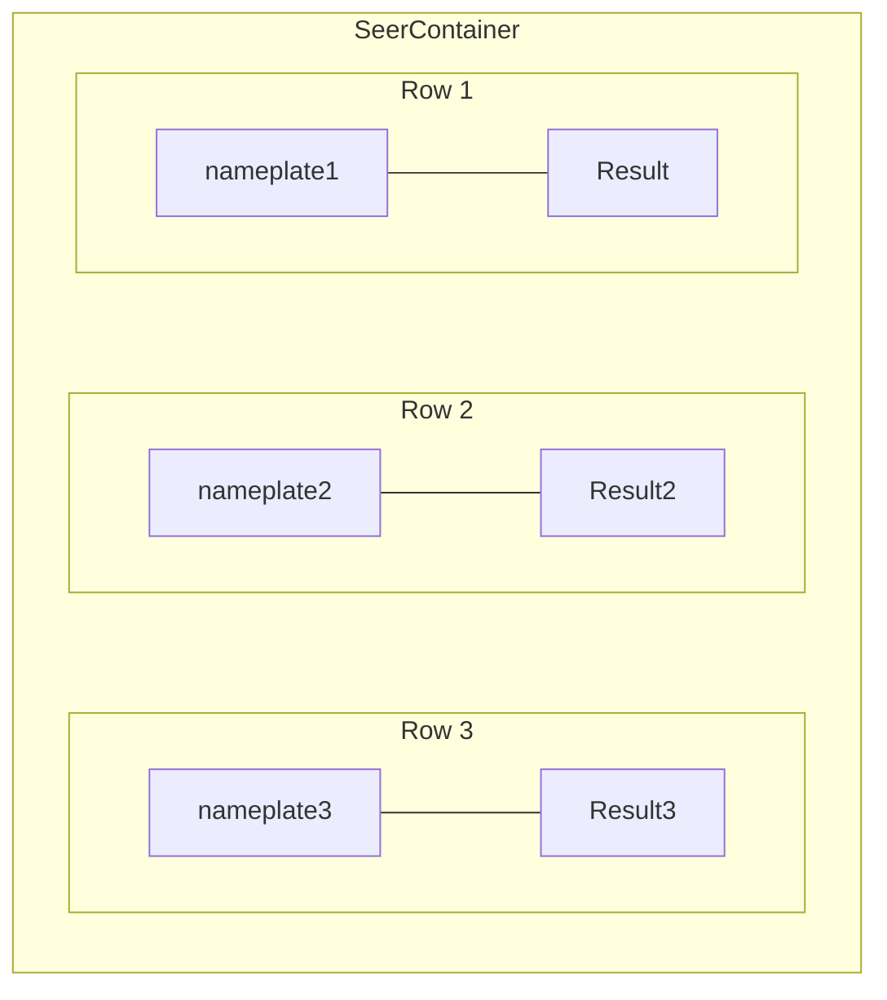

---

---
# 環境構築

vscodeで[Markdown Preview Enhanced](https://shd101wyy.github.io/markdown-preview-enhanced/#/ja-jp/)をいれる
以下を記載
>```mermaid
>```
# 基本構文

```markdown
%% config
---
title: Hello Title
config:
  theme: forest
---
%% 最初に図の種類を記載
sequenceDiagram
classDiagram
```
# クラス図
### メンバ定義
```markdown
classDiagram
	class classA {
	  <<ステレオタイプ>> %% ここでもステレオタイプ設定できる
	  - privateFiled: String 
	  attr1: int = 10 %% 初期値
	  attr2 : List~string~ %%ジェネリクス<>を表現
	  + staticMethod() $
	  abstractMethod() String * 
}
```

### 関連と多重度

```
ClassA -- ClassB %% 関連
ClassC --> ClassD %% 単方向関連 (強い関連.インスタンス化)
ClassE .. ClassF %% 依存
ClassG ..> ClassH %% 依存 (弱い関連.メソッドの一時使用etc)
ClassI <|-- ClassJ %% 継承 JがIを継承
ClassK <|.. ClassL %% 実装
ClassM *-- ClassN %% 合成(composition.集約より強い所有関係.子は親にライフサイクルを依存)
ClassO o-- ClassP %% 集約(Aggregation.合成より弱い所有関係.子は親にライフサイクルを依存しない)
%% 多重度
Hoge "1" -- "0..*" Fuga
```
### グループ
```markdown
classDiagram
	namespace DataModels { %%namespaceと記載
		class A {
			filedX : int
		}
	}
```
# シーケンス図

### 基本構文

```markdown
sequenceDiagram
	autonumber %% オートナンバー
	participant box1 %% ライフラインの定義
	actor act1 %% アクターの定義(棒人間)
	box1 ->> box2: hi %% ->>同期メッセージ
	box2 -->> box1: ret %% -->>リプライメッセージ
```

### ライフラインの生成と破棄



### グループ化

```markdown
# lifelineをグループ
box groupA %%グループの枠組みを表示
participant lifelineA
participant lifelineB
end

# メッセージをグループ
rect rgb(200, 230, 255)
    A ->> B: 重要なメッセージ
    B ->> A: 応答
end
```

### Alias

```markdown
participant servier as xxxさんのサーバー
# 内部名 as 表示名 
```

### アクティブ, ループ, 条件分岐, ノート



# アーキテクチャ図


***
	# flowchart(graph)
```markdown
%% 方向設定
%% graph TD // Top to Down（上から下）
%% graph BT // Bottom to Top（下から上）
%% graph LR // Left to Right（左から右）
%% graph RL // Right to Left（右から左）

%% ノードの形状
graph LR
	id1[四角形]
	id2(丸括弧付き)
	id3([角丸四角形])
	id4[[サブルーチン]]
	id5[(データベース)]
	id6((円形))
	id7>非対称]
	id8{ひし形}
	id9{{六角形}}
	id10[/平行四辺形/]
	id11[\逆平行四辺形\]
	id12[/台形\]
	id13[\逆台形/]

%% サブグラフ
graph TB
    subgraph サブグラフ名
	    direction TB %% subgraph内の方向指定
        a1 --> a2
    end
    subgraph サブグラフ2
        b1 --> b2
    end
    a1 --> b2

%% 接続線の種類
graph LR
	A ~~~ B %% 透明接続線
    A --> B    // 矢印
    C --- D    // 線
    E -.-> F   // 点線矢印
    G -.- H    // 点線
    I ==> J    // 太い矢印
    K === L    // 太い線
    M --テキスト--> N    // テキスト付き矢印
    O --テキスト--- P     // テキスト付き線
    Q ==テキスト==> R    // テキスト付き太い矢印
    S ==テキスト=== T    // テキスト付き太い線
    U -.テキスト.-> V    // テキスト付き点線矢印

```
## flowchartでワイヤーフレームを作成する
> subgrapでコンテナを階層的に表現する。
> 行単位でsubgraphを作成するとUIのフレームワーク風になる

